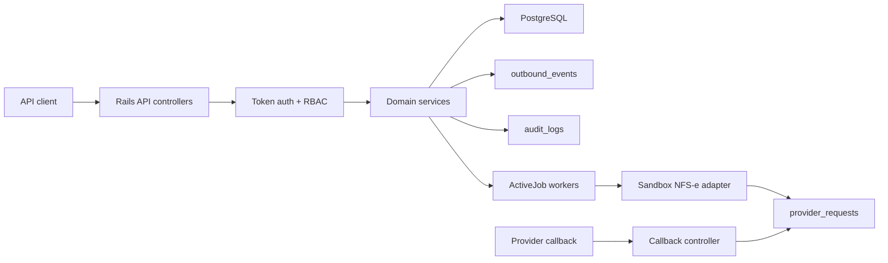

# Architecture Overview

FiscalBridge is organized around explicit boundaries:

- **HTTP boundary**: versioned JSON API controllers validate authentication, authorization, idempotency, and optimistic-lock preconditions.
- **Domain services**: `Invoices::Create`, `Invoices::Issue`, `Invoices::Cancel`, and membership services own transaction boundaries and state transitions.
- **Provider boundary**: `Providers::SandboxNfseClient` represents the external NFS-e provider adapter contract.
- **Async boundary**: ActiveJob workers perform provider calls after database commit.
- **Evidence boundary**: `provider_requests`, `audit_logs`, and `outbound_events` preserve fiscal and operational evidence.

The app uses tenant-scoped database lookups everywhere a user-visible resource is read. Public invoice ids are unique only inside a tenant; numeric ids stay internal.
