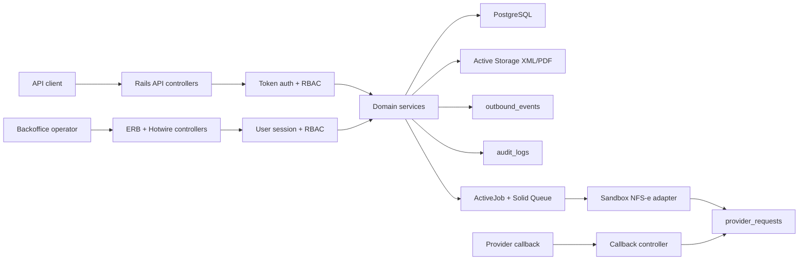

# Architecture Overview

FiscalBridge is organized around explicit boundaries:

- **HTTP boundary**: versioned JSON API controllers validate authentication, authorization, idempotency, and optimistic-lock preconditions.
- **Web boundary**: ERB/Hotwire backoffice controllers handle human sessions, tenant-scoped inspection, and safe operator actions.
- **Domain services**: `Invoices::Create`, `Invoices::Issue`, `Invoices::Cancel`, and membership services own transaction boundaries and state transitions.
- **Provider boundary**: `Providers::SandboxNfseClient` represents the external NFS-e provider adapter contract.
- **Async boundary**: ActiveJob workers run on Solid Queue and perform provider calls after database commit.
- **Evidence boundary**: `provider_requests`, `audit_logs`, and `outbound_events` preserve fiscal and operational evidence.

The app uses tenant-scoped database lookups everywhere a user-visible resource is read. Public invoice ids are unique only inside a tenant; numeric ids stay internal. Human web users authenticate through `User`/`Session`, while machine clients continue to authenticate through membership API tokens.

## Formal architecture

FiscalBridge is a modular Rails monolith. The codebase is intentionally kept in
one deployable unit, but the runtime responsibilities are separated into
explicit architectural boundaries.

| Layer | Responsibility | Primary files |
| --- | --- | --- |
| Delivery | Translate HTTP/API/web requests into application commands. | `app/controllers/api_controller.rb`, `app/controllers/v1/*`, `app/controllers/backoffice/*`, `app/views/backoffice/*` |
| Identity and authorization | Authenticate API tokens and browser sessions, apply tenant and role boundaries. | `app/services/security/*`, `app/models/user.rb`, `app/models/session.rb`, `config/authorization_matrix.yml` |
| Domain application services | Own fiscal use cases, transactions, idempotency, state transitions, audit writes, and after-commit job enqueueing. | `app/services/invoices/*`, `app/services/events/*`, `app/services/auditing/*` |
| Domain model | Enforce local invariants, tenant relationships, validation, and serialization. | `app/models/organization.rb`, `app/models/service_invoice.rb`, `app/models/provider_request.rb`, `app/models/outbound_event.rb` |
| Provider adapters | Translate FiscalBridge commands into external fiscal provider calls. | `app/services/providers/*`, `docs/adr/005-provider-ports-and-adapters.md` |
| Async runtime | Execute provider calls and event dispatch outside request transactions. | `app/jobs/*`, `config/queue.yml`, `bin/jobs` |
| Evidence and storage | Preserve provider request evidence, fiscal artifacts, audit logs, and outbound events. | `provider_requests`, `audit_logs`, `outbound_events`, Active Storage tables |
| Observability | Expose health, readiness, metrics, traces, request ids, and correlation ids. | `app/controllers/platform_controller.rb`, `config/initializers/open_telemetry.rb`, `app/services/observability/*` |

## Runtime topology

The production-shaped topology is:

- Rails web/API process served by Puma/Thruster.
- Solid Queue worker process running `bin/jobs`.
- PostgreSQL as the primary database for domain data, Solid Queue, Solid Cache,
  Solid Cable, sessions, and Active Storage metadata.
- Active Storage artifact backend for XML/PDF files.
- External fiscal provider adapter selected by provider/environment
  configuration.
- Optional OpenTelemetry collector and Prometheus scraper.

Kamal deploys the same monolith as separate process roles rather than separate
services. That keeps operational boundaries explicit without forcing
distributed transactions.

## Architectural invariants

- Controllers do not decide fiscal state transitions; domain services do.
- Domain services do not know provider protocol details; adapters do.
- Jobs do not enqueue before database commit.
- Provider callbacks do not bypass idempotency, tenant scoping, or provider
  evidence recording.
- API commands carry `If-Match`; web commands carry rendered `lock_version`.
- Fiscal XML/PDF bytes are treated as sensitive evidence and must remain
  tenant-scoped.
- Homologation and production provider configuration must remain separate.

## Reference documents

- Provider port decision: [`docs/adr/005-provider-ports-and-adapters.md`](../adr/005-provider-ports-and-adapters.md)
- Consistency model: [`docs/architecture/data-consistency.md`](data-consistency.md)
- Fiscal threat model: [`docs/security/fiscal-threat-model.md`](../security/fiscal-threat-model.md)
- Event contracts: [`docs/events/README.md`](../events/README.md)
- Production hardening: [`docs/security/production-hardening-tradeoffs.md`](../security/production-hardening-tradeoffs.md)
