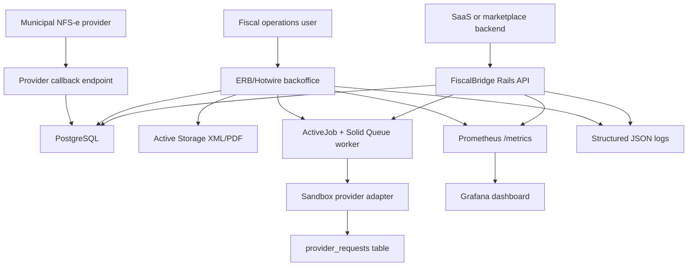

# Container Diagram

```mermaid
flowchart TB
  Client["SaaS or marketplace backend"] --> API["FiscalBridge Rails API"]
  Operator["Fiscal operations user"] --> Web["ERB/Hotwire backoffice"]
  Provider["Municipal NFS-e provider"] --> Callback["Provider callback endpoint"]
  API --> DB["PostgreSQL"]
  Web --> DB
  Web --> Storage["Active Storage XML/PDF"]
  API --> Jobs["ActiveJob + Solid Queue worker"]
  Web --> Jobs
  Jobs --> ProviderAdapter["Sandbox provider adapter"]
  ProviderAdapter --> ProviderEvidence["provider_requests table"]
  API --> Metrics["Prometheus /metrics"]
  Web --> Metrics
  Metrics --> Grafana["Grafana dashboard"]
  API --> Logs["Structured JSON logs"]
  Web --> Logs
  Callback --> DB
```
